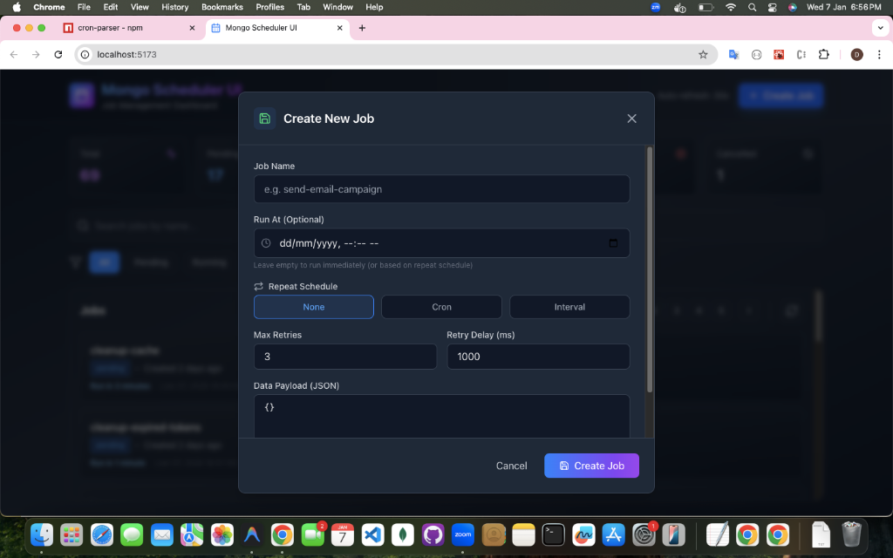

# Mongo Scheduler UI



Beautiful, responsive dashboard for managing jobs from `mongo-job-scheduler`.

## 🚀 Quick Start

### Prerequisites

- Node.js 18+
- MongoDB running locally or remote connection string
- mongo-job-scheduler jobs in your database

### 1. Frontend Setup

```bash
cd mongo-scheduler-ui
npm install
npm run dev
```

The UI will be available at `http://localhost:5173`

### 2. Backend API Setup

Clone and setup the **[Mongo Scheduler API](https://github.com/darshanpatel14/mongo-job-scheduler-api)** repository. Follow the instructions in its README to start the server at `http://localhost:3000`.

The API will be available at `http://localhost:3000`

## 📁 Project Structure

```
mongo-scheduler-ui/
├── src/                    # React frontend
│   ├── components/         # UI components
│   ├── services/           # API client
│   ├── types/              # TypeScript types
│   └── utils/              # Helper functions
└── package.json
```

## 🎨 Features

- **📊 Real-time Dashboard** - Auto-refresh every 5 seconds
- **🔍 Search & Filter** - Find jobs by name and status
- **📈 Statistics** - Total, pending, running, completed, failed jobs
- **🎯 Job Actions** - Delete, retry (failed), cancel (pending/running)
- **📝 Job Details** - Full job information in a beautiful modal
- **🎨 Modern Dark Theme** - Gradient-based design with glassmorphism
- **📱 Responsive** - Works on mobile, tablet, and desktop

## 🔌 API Endpoints

See `server/README.md` for full API documentation.

## 🎯 Usage

1. Start MongoDB
2. Start the backend API: `cd server && npm run dev`
3. Start the frontend: `npm run dev`
4. Open `http://localhost:5173` in your browser

## 🔧 Configuration

### Frontend (.env)

```
VITE_API_URL=http://localhost:3000
```

### Backend (server/.env)

```
MONGO_URL=mongodb://localhost:27017
DB_NAME=scheduler
PORT=3000
```

## 🎨 Customization

### Add Job Handlers

Edit `server/index.js`:

```javascript
handler: async (job) => {
  if (job.name === "send-email") {
    // Your email logic
  } else if (job.name === "process-payment") {
    // Your payment logic
  }
};
```

### Modify Theme

Edit `src/index.css` for colors and styling.

## 📦 Tech Stack

- **Frontend**: React 18, Vite, TypeScript, Tailwind CSS
- **Backend**: Express, mongo-job-scheduler, MongoDB
- **Icons**: Lucide React
- **Date Formatting**: date-fns

## 🚢 Deployment

### Frontend

```bash
npm run build
# Deploy dist/ folder to Vercel, Netlify, etc.
```

### Backend

Please refer to the **[Mongo Scheduler API](https://github.com/darshanpatel14/mongo-job-scheduler-api)** repository for deployment instructions.

## 📄 License

MIT
